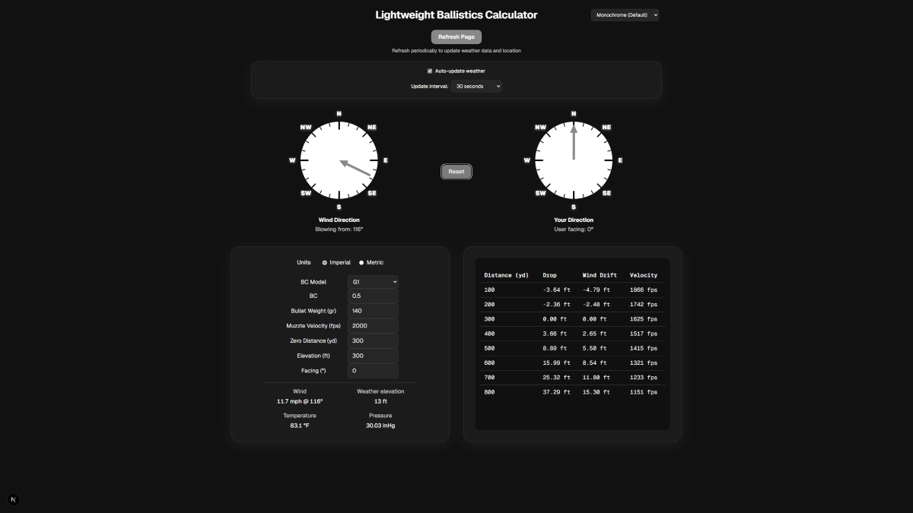
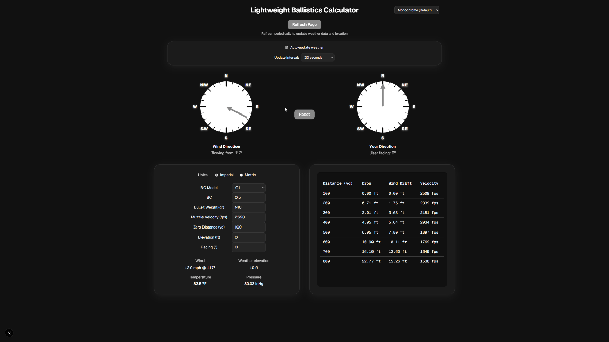

# Lightweight Ballistics Calculator 🎯

A real-time long-range ballistics calculator web app for shot estimation up to 800 yards/meters.
It combines ballistic modeling, live weather data, and compass-based shooter direction to generate dynamic trajectory outputs.





⚠️ All calculations are estimates only and should not be used for unsafe, harmful, or malicious purposes. ⚠️


## 🧩 Tech Stack

### Core


### Quality & Testing


### CI / Dev Workflow


## 🎥 Live Demo

This repository contains a real-time interactive trajectory calculator with:
- Trajectory drop and wind drift estimation
- Impact velocity estimation
- Weather-driven environmental updates
- Device-based directional input (where supported)




## ✨ Features

- Trajectory drop & wind drift calculations
- Impact velocity estimation
- Interactive user-direction compass
- Metric & imperial unit support
- G1/G7 ballistic coefficient models
- Weather + elevation integration
- Configurable weather update intervals
- Privacy-first behavior (no auth, cookies, or persistent user data)


## 🚀 Quick Start

### Installation

```bash
git clone <your-repo-url>
cd lightweight-ballistics-calculator
npm install
```


### Run locally

```bash
npm run dev
```

Open `http://localhost:3000` in your browser.


## 🧪 Testing

- Unit tests verify ballistic solver behavior and trajectory-related invariants
- UI components are tested to validate interaction behavior
- Compass logic includes property-based testing for directional consistency
- React component tests run in a simulated DOM (`jsdom`) environment


## ⚙️ Runtime Notes

- Weather data is fetched from Open-Meteo (no API key required)
- Geolocation permission is required for location-based weather updates
- Device orientation is used for compass input when supported by browser/device
- The app runs client-side with no user account system or server-side user storage


## 📜 Scripts

```bash
npm run dev
npm run lint
npm run test
npm run build
npm run verify          # lint + test + build (matches CI)
npm run audit:check     # optional: npm audit (moderate+)
npm run audit:prod      # optional: audit production deps only
npm run verify:all      # optional: verify then audit:check
```


## 📁 Project Structure

```text
src/
  app/                  # Route entry + global styles
  components/           # UI components
    controls/           # Reusable form/control components
    trajectory/         # Shot table chart
    weather/            # Weather display components
    Compass.tsx         # Interactive compasses (test: Compass.test.tsx)
  hooks/                # Stateful app logic (device heading, weather, trajectory data)
  lib/                  # Domain logic and pure utilities
  types/                # Shared TypeScript types
```


## 🛠️ Architecture Notes

- `src/app/page.tsx` is a composition layer (layout + wiring), not a logic dump
- State-heavy concerns are isolated into hooks:
  - `useDeviceHeading` for sensor direction handling
  - `useWeather` for geolocation/weather polling
  - `useTrajectoryData` for shot table derivation
- Reusable UI pieces live under `components/controls`, `components/weather`, `components/trajectory`, and top-level `components/*` (e.g. `Compass.tsx`)
- Domain math and API integration stay in `lib` for testability and reuse


## 🗺️ Potential Roadmap

- Public web deployment
- Desktop application
- Mobile version

Current state: this project is currently maintained as a GitHub repository and local web app.


## ⚠️ Disclaimer

This application is provided "as is" and "as available," without warranties of any kind, express or implied. The authors make no representations or guarantees regarding the accuracy, reliability, or completeness of any calculations or outputs.

All results are derived from simplified ballistic models and are intended for informational and educational use only. They do not account for all real-world variables and should not be used as a substitute for professional tools or judgment.

Under no circumstances shall the authors be held liable for any damages or consequences arising from the use or misuse of this software.


## 🙏 Acknowledgement

This project was built with assistance from Cursor AI IDE.


## 🤝 Contributing

Contributions are welcome and encouraged. See `CONTRIBUTING.md`.